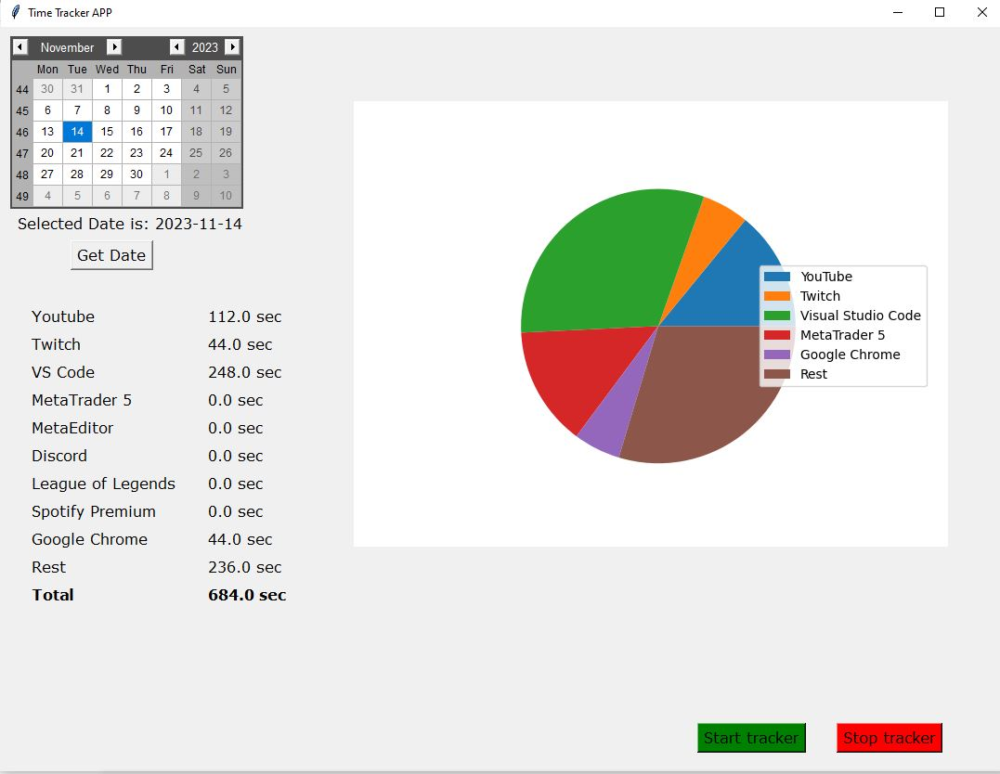

# Time-Tracker

This simple Time Tracker written in Python helps you to manage your screen time.
Running the tracker_interface_with_db.py will open a GUI, where you can look at your time spent in different applications.
In the first version of this programm, you can see the time spent per day per application.
In the future you will be able to select the programms you want to track, get a time spent overview over a week and month.
Another feature that I am working on is the ability to track the amount of spent on specific projects.
All of the data is stored in a local MySQL database, so you will have to setup this database the first time you use this application.
To allow python to track the open application as well as showing the interface, I used threading.

## User interface
