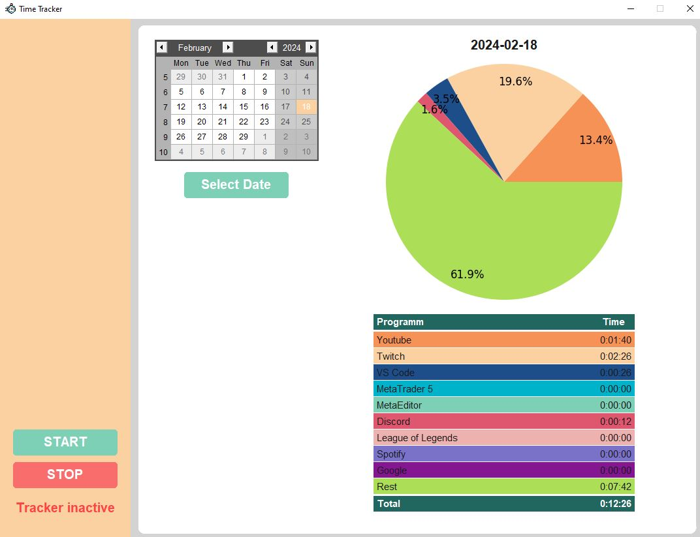

# Time-Tracker

## Overview

Time Tracker is a simple Python application designed to help you monitor and track the time you spend on various applications. The program runs in the background, continuously updating and storing data to provide you with insights into your productivity and time allocation.

## Roadmap
In the future you will be able to select the programms you want to track, get a time spent overview over a week or month.
Another feature that I am working on is the ability to track the time spent on specific projects/files.

## Features

- **User-Friendly Interface**: The application features an intuitive graphical user interface, allowing you to easily start and stop the tracking process.

- **Real-time Tracking**: Time Tracker monitors your active application in real-time, recording the duration you spend on each application.

- **Data Visualization**: The program provides a visual representation of your time usage through a pie chart, offering a quick overview of the distribution of your activities.

- **Daily Summary**: Get a detailed daily summary of your time spent on specific applications, helping you identify patterns and optimize your workflow.

## Installation

To use Time Tracker, follow these steps:

1. Clone the repository:

   ```bash
   git clone https://github.com/weirdo1400/Time-Tracker.git
2. Install the required dependencies: (Not ready yet, I'm working on it)

   ```bash
   pip install -r requirements.txt
   ```

3. Run the program:

   ```bash
   python tracker_interface_with_classes.py
   ```

## Usage

1. Start the application.
2. Use the "START" button to begin tracking your time.
3. The program will display the currently active application and continuously update the time spent on it. 
4. To get an update, you currently have to press the "STOP" button and the "Select Date" Button.
5. Stop the tracking process using the "STOP" button.
6. View detailed daily summaries and visualizations.

---

**Note:** This README provides a brief overview of the Time Tracker application. For detailed instructions and documentation, please refer to the source code and comments in the provided Python files (`tracker_interface_with_classes.py` and `tracker_with_threading.py`).

## User interface

